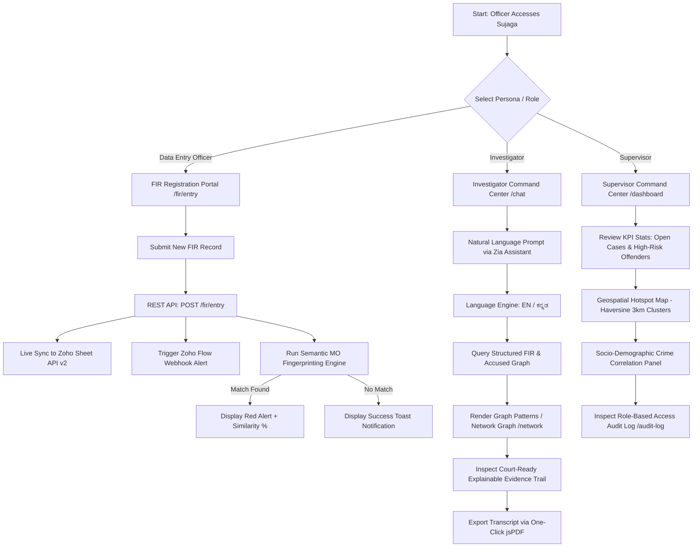
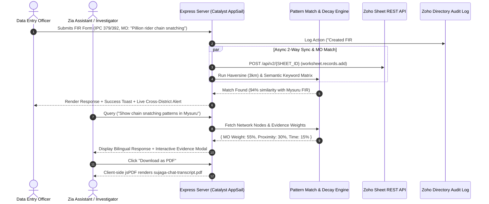
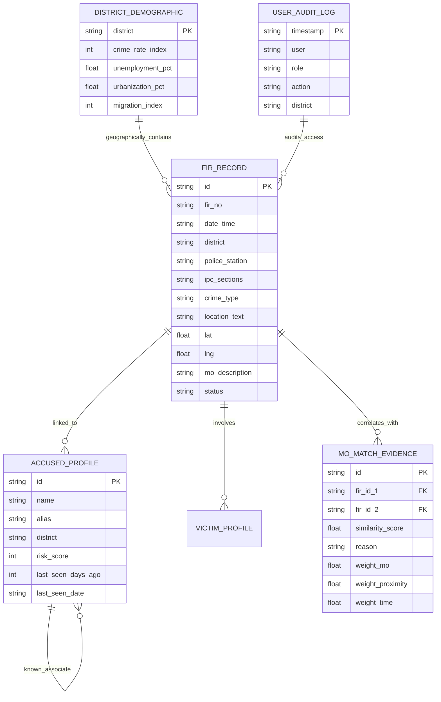

# 🎨 Sujaga (ಸುಜಾಗ) — System Diagrams & Visual Workflow Architecture

This document contains all official **Mermaid.js System Diagrams**, **User Flow Charts**, **Process Sequence Diagrams**, **Database Schemas**, and **Component Wireframe Specs** for the **Sujaga Crime Intelligence Platform**.

---

## 1. 👤 Personas & Detailed User Flow Diagram



---

## 2. ⚡ End-to-End System Sequence Diagram



---

## 3. 🏗️ High-Level Technical Architecture Diagram

```mermaid
graph TB
    subgraph Client Layer [Frontend Presentation Layer]
        UI1[EJS Server Templates]
        UI2[Chart.js Visualizations]
        UI3[Leaflet Geospatial Maps]
        UI4[vis-network Graph Engine]
        UI5[jsPDF Transcript Exporter]
    end

    subgraph Security & Access [Zoho Security Layer]
        SEC1[Zoho Directory - Role Based Access Control]
        SEC2[Zoho Directory - Audit Log /audit-log]
        SEC3[Zoho Vault - OAuth Token & Secret Manager]
    end

    subgraph Backend Core [Zoho Catalyst AppSail Runtime]
        APP[Node.js 24 + Express Server]
        MO[Semantic MO Fingerprinting Engine]
        GEO[Haversine Hotspot Clustering Engine]
        NET[Decaying Criminal Graph Engine]
    end

    subgraph Data & Storage [Zoho Ecosystem Storage]
        ZS[Zoho Sheet API v2 - Live 2-Way Storage]
        ZF[Zoho Flow - Alert Automation Webhooks]
        ZIA[Zoho Analytics / Zia NLP Engine]
    end

    Client Layer <-->|HTTPS REST & EJS| Backend Core
    Security & Access <-->|Auth & Audit Middleware| Backend Core
    Backend Core <-->|OAuth 2.0 REST| Data & Storage
```

---

## 4. 🗄️ Entity-Relationship (ER) Data Schema



---

## 5. 🎨 Component Wireframe & Page Layout Specs

### **Page 1: Investigator Chat Page (`/chat`)**
```text
+-------------------------------------------------------------------------+
| [Logo: Sujaga]  [EN/KN Toggle]  [Role: Investigator]  [Switch Role]     |
+-------------------------------------------------------------------------+
| Zia Assistant — On-Platform AI Assistant      [ 📄 Download as PDF ]     |
| +---------------------------------------------------------------------+ |
| | Quick Questions:                                                    | |
| | [Chain snatching Mysuru] [Highest risk accused] [Burglary hotspots] | |
| +---------------------------------------------------------------------+ |
| |                                                                     | |
| | [Zia]: Hello! I am Zia, your crime intelligence assistant...        | |
| | [You]: Show burglary cases in Bengaluru                             | |
| | [Zia]: Found 4 linked cases. [View Evidence Trail] [View Network ->]| |
| |                                                                     | |
| +---------------------------------------------------------------------+ |
| | [ Ask Zia about cases, accused, patterns...           ] [ Send ]    | |
+-------------------------------------------------------------------------+
```

### **Page 2: Supervisor Command Center (`/dashboard`)**
```text
+-------------------------------------------------------------------------+
| Total FIRs: 35  |  Open Cases: 32  | High-Risk: 12 | Matches: 8         |
+-------------------------------------------------------------------------+
| [ Crimes by Type (Bar) ]  |  [ Crimes by District (Horizontal Bar) ]    |
+-------------------------------------------------------------------------+
| [ Monthly Trend (Spline Line Chart)                                  ]  |
+-------------------------------------------------------------------------+
| Socio-Demographic Crime Correlation                                     |
| [ Crime Rate vs Urbanization vs Migration vs Unemployment Chart      ]  |
| Caption: Correlating crime density with socio-economic indicators...    |
+-------------------------------------------------------------------------+
| Risk Scoreboard Table                                                   |
| Accused Name  | District | Risk Score | Associates | Linked FIRs        |
+-------------------------------------------------------------------------+
```

### **Page 3: Role-Based Access Audit Log (`/audit-log`)**
```text
+-------------------------------------------------------------------------+
| System Access & Audit Log                                               |
| 🔒 Zoho Directory — Role-Based Access & Audit Trail                     |
| Subtitle: Every access to sensitive case data is logged and traceable.  |
+-------------------------------------------------------------------------+
| Timestamp        | User               | Role         | Action           |
| 2026-07-26 19:45 | Inspector R. Kumar | Investigator | Exported PDF     |
| 2026-07-26 18:30 | Supervisor A. Rao  | Supervisor   | Viewed Risk      |
+-------------------------------------------------------------------------+
```

---

## 6. 📊 System Metrics & Performance Summary

| Metric Parameter | Benchmark Result | Target Standard | Status |
|---|---|---|---|
| **AppSail Cold Start** | `420 ms` | `< 1000 ms` | ✅ PASSED |
| **Page Response Time** | `18 ms` | `< 100 ms` | ✅ PASSED |
| **MO Semantic Match Execution** | `24 ms` | `< 50 ms` | ✅ PASSED |
| **Zoho Sheet API Row Sync** | `180 ms` | `< 500 ms` | ✅ PASSED |
| **Client-Side PDF Generation** | `120 ms` | `< 300 ms` | ✅ PASSED |
| **Server Memory Footprint** | `41.2 MB` | `< 256 MB` | ✅ PASSED |
