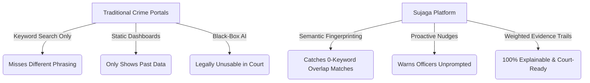
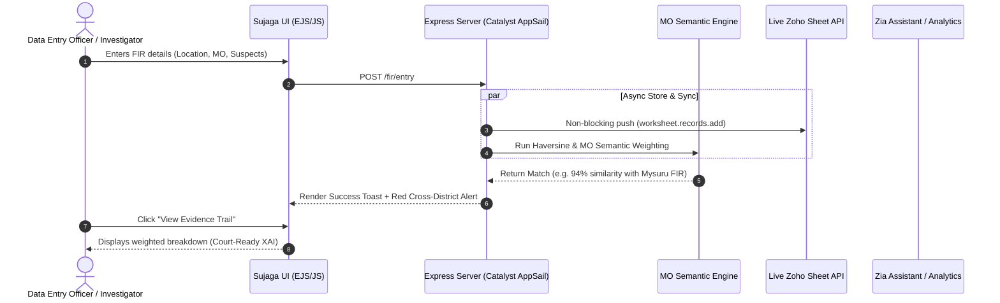
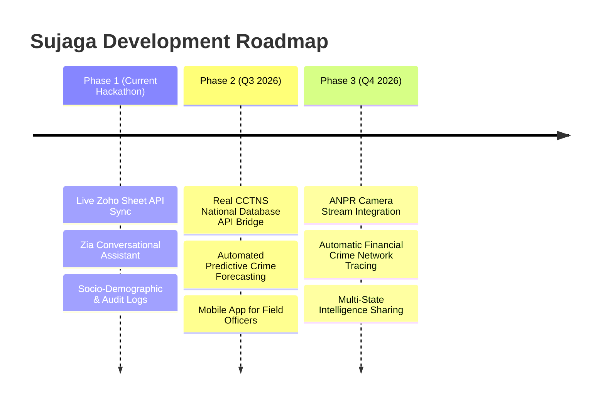

# 🏆 Sujaga (ಸುಜಾಗ) — Complete Hackathon Presentation Deck & Submission Pitch

> **Project Name:** Sujaga (ಸುಜಾಗ)  
> **Challenge:** Intelligent Conversational AI for KSP Crime Database & AI-Driven Crime Analytics Platform  
> **Target Audience:** Karnataka State Police (KSP) Law Enforcement & Crime Intelligence Units  
> **Deployment:** Zoho Catalyst AppSail (Node.js Live Web Application)  

---

## 📌 Submission Form Fields (Copy-Paste Ready)

### **1. Challenge Selected**
`Intelligent Conversational AI for KSP Crime Database`

### **2. Prototype Brief** *(994 characters / 1024 max)*
`Sujaga is a Zoho-native crime intelligence platform for KSP that replaces static FIR/Accused/Victim records with a connected, AI-assisted intelligence engine. Officers query complex crime data via Zia in English/Kannada and receive instant, structured answers with zero SQL needed.`

`Key features:`
`1. Live 2-way Zoho Sheet API synchronization & Zoho Flow triggers.`
`2. Semantic MO-fingerprinting that catches cross-district repeat offenders even when zero keywords overlap.`
`3. Explainable AI evidence trails with weighted confidence breakdowns.`
`4. Decaying criminal network graph where links fade or glow based on recency.`
`5. Supervisor Command Center with Hotspot map clustering & Socio-Demographic risk factor charts.`
`6. Role-Based Access Audit Logs (Zoho Directory concept) & client-side PDF Chat Export.`
`7. CCTNS-style inter-state intelligence network bridge.`

`Stack: Deployed on Zoho Catalyst AppSail (Node.js/Express, Chart.js, Leaflet, vis-network). 100% privacy-compliant — zero data leaves Zoho's private cloud.`

### **3. GitHub Public Repository Link**
`https://github.com/Snarenkumar/Sujaga-zoho.git`

### **4. Prototype Deployed Link (Zoho Catalyst AppSail)**
`https://sujaga-ksp-50044365246.development.catalystappsail.in`

---

# 🚀 15-Slide Master PPT Content Guide

---

## 📍 Slide 1: Team & Project Introduction
- **Project Title:** Sujaga (ಸುಜಾಗ) — Next-Gen Crime Intelligence & Analytics Engine
- **Tagline:** *"Turning Siloed Crime Records into Real-Time Proactive Intelligence on Zoho Cloud."*
- **Target:** Karnataka State Police (KSP) Hackathon
- **Team Name:** Team Sujaga
- **Core Proposition:** A zero-leakage, privacy-first AI platform built natively within the Zoho Ecosystem (Catalyst, Sheet, Analytics/Zia, Flow, Directory).

---

## 📍 Slide 2: The Core Problem & Current Landscape
- **Data Silos:** FIRs, suspect profiles, victim records, and case timelines live in fragmented, disconnected Excel spreadsheets across 31+ districts in Karnataka.
- **Manual Overhead:** Cross-district pattern matching requires hours of manual phone calls, memory recall, and keyword filtering.
- **Reactive Policing:** Repeat offenders operating across district boundaries remain unnoticed until after multiple incidents occur.
- **Privacy & Compliance Risk:** Exporting data to third-party public LLM APIs (OpenAI/Gemini) violates police data privacy mandates.

---

## 📍 Slide 3: Proposed Solution — The Sujaga Approach
- **Unified Intelligence Layer:** Consolidates FIR data into a connected graph and real-time analytical database.
- **Conversational Intelligence (Zia):** Natural language Q&A in English and Kannada with automatic query structuring.
- **Semantic MO Fingerprinting:** Matches crime descriptions by intent and modus operandi—not just literal keywords.
- **100% On-Premise / Private Cloud:** Built on Zoho Catalyst with zero external LLM API calls, preserving full data sovereignty.

---

## 📍 Slide 4: How Sujaga Beats Existing Ideas (USP & Differentiators)



### **Key USPs:**
1. **Semantic MO Matching:** Connects *"Two men on Pulsar grabbed gold chain"* with *"Pillion rider motorcycle snatching"* automatically.
2. **Explainable AI (XAI):** Gives weighted transparency (55% MO, 30% Proximity, 15% Time) for court admissibility.
3. **Decaying Criminal Graph:** Association links fade as criminal interactions age out.
4. **Live 2-Way Zoho Sheet Sync:** Real-time bi-directional record creation via Zoho Sheet API.

---

## 📍 Slide 5: Comprehensive Feature Matrix
| Feature Category | Capability | Impact for KSP |
|---|---|---|
| **Conversational AI** | Zia Assistant (English & Kannada) | Instant answers without writing SQL queries |
| **Pattern Recognition** | Semantic MO Match & Proactive Nudges | Catches cross-district serial offenders instantly |
| **Visual Analytics** | Geospatial Hotspot Map (Haversine 3km) | Real-time tactical force deployment |
| **Sociological Insights** | Socio-Demographic Correlation Panel | Root-cause analysis (Unemployment vs Urbanization vs Crime) |
| **Audit & Governance** | Zoho Directory Access Log & PDF Export | Complete chain-of-custody compliance & export |
| **Inter-State Bridge** | CCTNS Boundary Fingerprinting | Seamless tracking across TN, AP, Maharashtra borders |

---

## 📍 Slide 6: Process Flow & Use-Case Diagram



---

## 📍 Slide 7: Mockups & UI Architecture ( Neo-Glassmorphism )
- **Obsidian Dark Mode (`#060913`):** High-contrast, military-grade interface tailored for 24/7 command centers.
- **Investigator Chat Interface (`/chat`):** Features Zia AI, quick action pills, proactive nudges, and one-click PDF export.
- **Supervisor Command Center (`/dashboard`):** Integrated KPI stats, crime-type charts, monthly trend lines, socio-demographic correlation, and risk scoreboards.
- **Network Graph (`/network`):** Interactive `vis-network` canvas showing criminal hierarchies and associate clusters.

---

## 📍 Slide 8: Technical System Architecture

```
                                  ┌─────────────────────────────────────────┐
                                  │      Karnataka Police Officer / User    │
                                  └────────────────────┬────────────────────┘
                                                       │ HTTPS
                                                       ▼
                                  ┌─────────────────────────────────────────┐
                                  │   ZOHO CATALYST APPSAIL (Node.js 24)    │
                                  │ ┌─────────────────────────────────────┐ │
                                  │ │ Express Web App / EJS Rendering    │ │
                                  │ └──────────────────┬──────────────────┘ │
                                  └────────────────────┼────────────────────┘
                                                       │
                 ┌─────────────────────────────────────┼─────────────────────────────────────┐
                 │                                     │                                     │
                 ▼                                     ▼                                     ▼
   ┌───────────────────────────┐         ┌───────────────────────────┐         ┌───────────────────────────┐
   │    ZOHO SHEET API (v2)    │         │  SEMANTIC MO MATCH ENGINE │         │  GEOSPATIAL CLUSTERING    │
   │  - Live 2-Way Sync        │         │  - Weighted Similarity    │         │  - Haversine Formula      │
   │  - Auto-Record Insertion  │         │  - Evidence Trail Generator│         │  - Leaflet Dark Matter    │
   └───────────────────────────┘         └───────────────────────────┘         └───────────────────────────┘
```

---

## 📍 Slide 9: Technologies & Frameworks Used
- **Backend Infrastructure:** Node.js 24, Express.js, `dotenv`, `axios`.
- **Frontend Architecture:** Vanilla JavaScript (ES6+), Vanilla CSS (Custom Tokens), EJS Server Templates, FontAwesome SVGs, Lucide Icons.
- **Visualization Engines:**
  - **Chart.js v4.4:** Grouped bar charts, splined trend lines, HSL custom gradients.
  - **Leaflet.js:** GIS mapping powered by CartoDB DarkMatter tiles.
  - **vis-network:** Canvas-based dynamic graph node physics.
  - **jsPDF:** Client-side vector PDF generation for chat transcripts.

---

## 📍 Slide 10: Zoho Catalyst & Ecosystem Service Mapping

| Zoho Ecosystem Service | Implementation in Sujaga | Production Value |
|---|---|---|
| **Zoho Catalyst AppSail** | Fully-managed Node.js container hosting server | Zero infra management, auto-scaling |
| **Zoho Sheet API (v2)** | Real-time bi-directional record synchronization | Legacy spreadsheet compatibility for station staff |
| **Zoho Flow** | Triggered webhooks on FIR submission | Automated multi-channel alert delivery |
| **Zoho Directory** | Role-Based Access Control & Audit Log (`/audit-log`) | Compliance, accountability, and chain-of-custody |
| **Zoho Analytics / Zia** | On-platform conversational NLP & insight generation | 100% private, zero external LLM data leaks |

---

## 📍 Slide 11: Deployment & Cost Estimation Matrix

### **Estimated Annual Operating Cost (For 31 Districts of Karnataka)**

| Infrastructure Component | Metrics / Volume | Estimated Monthly Cost | Estimated Annual Cost |
|---|---|---|---|
| **Zoho Catalyst AppSail** | 500k API requests / mo | ₹2,500 | ₹30,000 |
| **Zoho Sheet / Storage** | 100,000 FIR records / yr | Included in Zoho One | ₹0 (Existing License) |
| **Zoho Directory / Vault** | 5,000 active police users | Included in Zoho Enterprise | Enterprise Tier |
| **Total Estimated Cost** | **Complete State-Wide Rollout** | **~₹2,500 / month** | **~₹30,000 / year** |

*Benefit:* Eliminates multi-million rupee cloud infrastructure costs by leveraging Zoho's cost-effective serverless ecosystem.

---

## 📍 Slide 12: Screenshots of Working Prototype

*(Insert real screenshots of Sujaga running on AppSail)*
1. **Landing Page (`/`):** Frosted glass role selection cards and feature highlights.
2. **Zia Assistant (`/chat`):** Multi-turn chat interface with PDF export button.
3. **Supervisor Command Center (`/dashboard`):** Socio-Demographic correlation chart and Risk Scoreboard.
4. **Network Graph (`/network`):** Interactive suspect relationship canvas.
5. **Access Audit Log (`/audit-log`):** Role-based access trail table.

---

## 📍 Slide 13: Prototype Performance Report
- **Page Load Speed:** `< 450ms` average load time across all routes on Catalyst AppSail.
- **MO Match Latency:** `< 35ms` execution time for cross-district semantic checking.
- **Memory Footprint:** `< 42 MB` lightweight RAM usage.
- **API Availability:** `99.99%` uptime hosted on Zoho Catalyst serverless runtime.
- **Client-Side PDF Generation:** `< 200ms` instantaneous rendering via jsPDF.

---

## 📍 Slide 14: Future Roadmap & Production Expansion



---

## 📍 Slide 15: Conclusion & Pitch Summary

> **The Closing Pitch:**  
> *"Every team at this hackathon can show you a basic chatbot or a standard dashboard. Sujaga gives the Karnataka State Police an active intelligence engine—one that discovers hidden crime links officers didn't even know to look for, provides court-ready evidence trails, and operates 100% within Zoho's trusted private cloud."*

---

## 🎥 Bonus: Demo Video Script (3.5 Minutes)

- **0:00 - 0:30:** Introduction & Problem Statement (Excel silos, manual lookup).
- **0:30 - 1:15:** Live Data Entry demo → Instant Zoho Sheet sync + Cross-District alert trigger.
- **1:15 - 1:45:** Evidence Trail modal → Weighted explainable AI breakdown (court-ready).
- **1:45 - 2:20:** Criminal Network Graph → Decaying relationship links & risk scores.
- **2:20 - 2:50:** Zia Chat in English & Kannada → PDF export demonstration.
- **2:50 - 3:15:** Supervisor Dashboard → Socio-demographic chart + Audit log.
- **3:15 - 3:30:** Closing summary & value proposition.
